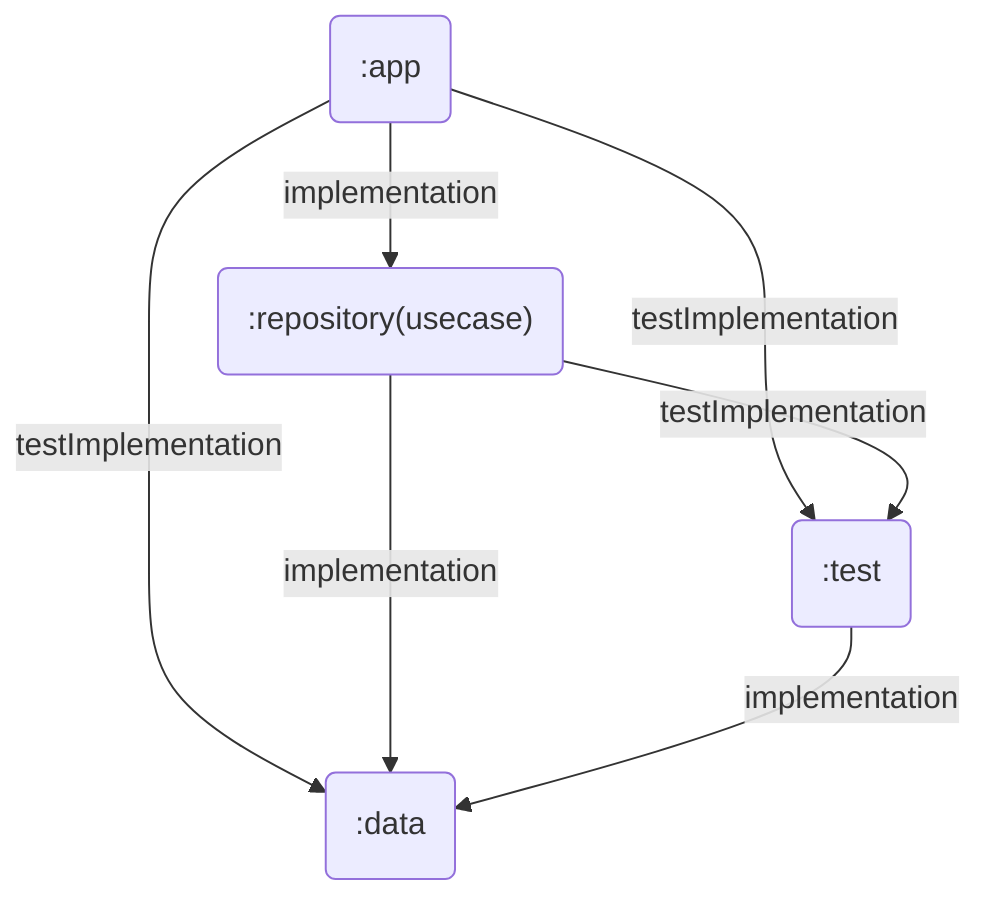

# NotionBoost

## About

NotionBoost 
You can easily check your Notion information on the Android home screen.

## Usage

### 1. Create an integration from ["My Integrations"](https://www.notion.so/my-integrations/) in Notion.

Please create an integration from [this page](https://www.notion.so/my-integrations/).
You can use any name for the integration. The default permissions granted to the integration include read and update and insert access to content, but NotionBoost only requires read access.

### 2. Register the created integration on your Notion page.

Please register the created Integration Secret on your Notion page. By selecting 'Add Connections' from the `...` in the top-right corner of the page, you will see the integration you created. 
For more details, please check [Notion Developers Guides](https://developers.notion.com/docs/create-a-notion-integration#give-your-integration-page-permissions)

### 3. Enter the Integration Secret in the first screen.

> [!WARNING]
> This screen does not perform Integration Secret validation. If you accidentally register an invalid Integration Secret, you will need to reinstall the app at this time.　(We plan to make it possible to change the Integration Secret within the app.)

|||
|:-:|:-:|
|| Please enter your Integration Key in the TextBox. After that, press 'Start using Notion Boost'. |

### 4. Add a widget from the home screen.

Simply add the NotionBoost widget to your home screen.
Long-press on the home screen to display available widgets for addition. Please select the NotionBoost widget from the options.

### 5. Enter the database id.

> [!WARNING]
> If the Integration Secret or Database ID is incorrect, the error reason will be displayed as a Snackbar at the bottom of the screen after pressing 'Create Widget'.

|||
|:-:|:-:|
|| Please enter the DatabaseId of the database  you want to display in the widget in the TextBox. After that, press 'Create Widget'. |

### 6. Check the widgets.

You can check the widgets you added to the home screen from within the app. The widgets update information approximately once every 24 hours, but you can manually update each widget from within the app.
The image below is an example of adding two widgets.

||
|:-:|
||

# For Developers

## Module structure

| Module name | Description | Test Strategy |
| :-: | :-: | :- |
| app | The typical UI layer including Fragments(for navigation), Composable(for UI), ViewModel(for state management). | Composable functions are tested with Screen-Shot-Test. ViewModels are tested are Unit-Test. |
| repository(usecase) | Exists solely to call the data layer, and as needed, usecases are created to encapsulate business logic | Conduct tests for the use case, validating inputs and outputs that make sense from a business perspective. Detailed implementation should not be tested. |
| data | All implementations affected by external dependencies are placed within this layer. Interfaces are exposed to upper layers, and Hilt is used for dependency injection of the productional implementation classes. | Do not perform tests on the data layer itself. However, Create Fake objects implementing each interface for testing purposes. |
| test | In the layers where unit testing is necessary, introduce dependencies on this module to enable the injection of test-specific fake objects. To achieve this, we create a TestModule within this module. |  |

