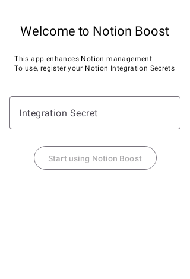

# NotionBoost

## About

NotionBoost 
You can easily check your Notion information on the Android home screen.

## Usage

### 1. Create an integration from ["My Integrations"](https://www.notion.so/my-integrations/internal/e269868283a74ac3b7c7f01d2c75105b) in Notion.

### 2. Register the created integration on your Notion page.

### 3. Enter the Integration Secret in the first screen.

> [!WARNING]
> This screen does not perform Integration Secret validation. If you accidentally register an invalid Integration Secret, you will need to reinstall the app at this time.　(We plan to make it possible to change the Integration Secret within the app.)

|||
|:-:|:-:|
|| Please enter your Integration Key in the TextBox. After that, press 'Start using Notion Boost'. |

### 4. Add a widget from the home screen.

### 5. Enter the database id.

|||
|:-:|:-:|
|| Please enter the DatabaseId of the database  you want to display in the widget in the TextBox. After that, press 'Create Widget'. |

### 6. Check the widgets.
